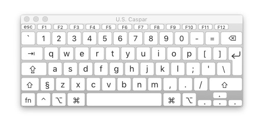
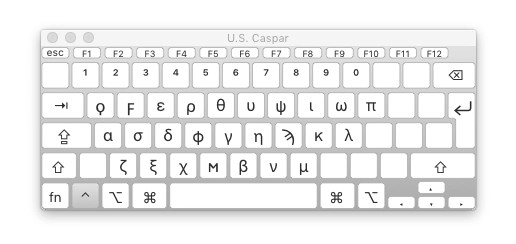
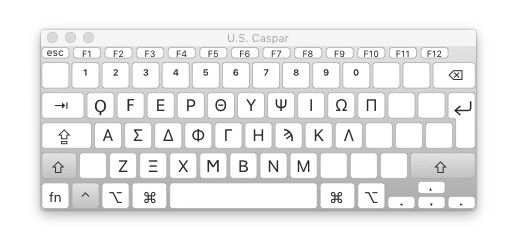
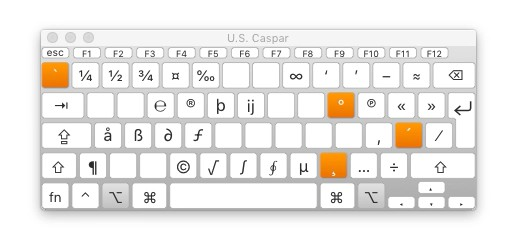

# keylayout-US-Caspar
MacOS keylayout with alt-modifier keys, ctrl-greek alphabet, remapped backtick and paragraph keys.

Save to:

    /Library/Keyboard Layouts/

## Screenshots

Base

Ctrl

Ctrl+shift

Alt

Alt+shift